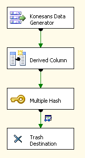
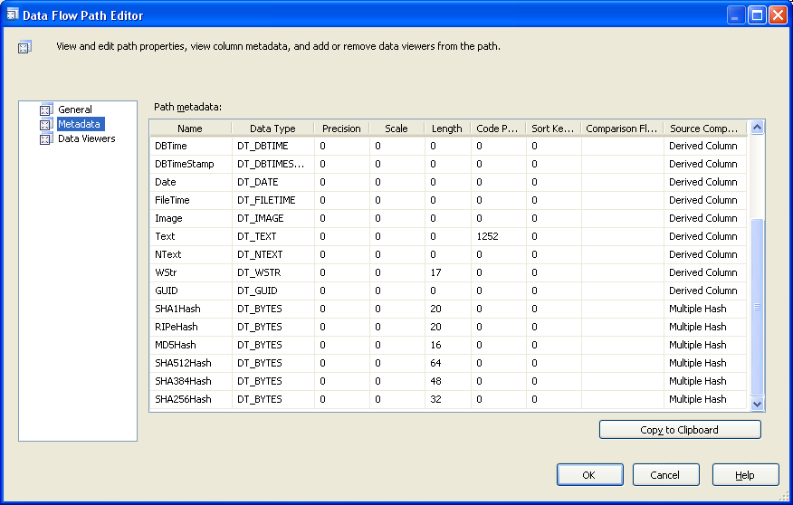

Creator: [Keith Martin](http://www.codeplex.com/site/users/view/kmartin)

Future?
As Codeplex is shutting down, I will be moving to a new source control location, before the closing date of Codeplex.
I'll investigate my options, and setup the "I've Moved" capability when the new location is available.

Description: SSIS Multiple Hash makes it possible to generate many Hash values from each input row.  Hash's supported include MD5 and SHA1.

[Download](https://ssismhash.codeplex.com/releases/):
The Default Download is for 64 bit machines, and detects SQL Server 2005 through SQL Server 2016.
The 32 bit download is also shown, but is not the default.
**You will need to re-install if you add a new version of SQL Server to your machine.**

**Upgrading SQL Versions**
If you install a new version of SQL Server, please ensure that you re-install SSIS Multiple Hash, as failure to do so will lead to SSIS packages that will not upgrade, if you edit and save them.
This is caused by the SSIS Upgrade process which only runs on the 1st opening of an older version SSIS package.  
If SSIS Multiple Hash for the editing version of SQL Server is not installed errors will be reported.
Do **NOT** save the SSIS package, as it will not upgrade again.
This issue is common to ALL third party SSIS components.

**Known Hash Change Condition**

If you run a package using a version of Multiple Hash prior to 1.6, that uses a Time or DateTime type, upgrade the package to version > 1.6 AND tick the Milliseconds option, then the hash generated **WILL BE DIFFERENT**.  To generate the same hash, ensure the Milliseconds option is turned OFF.
The upgrade of the package will NOT tick the Milliseconds option.
This should ONLY be done to maintain compatability with hash versions prior to 1.6.

**Known Installer Issue**
If you have relocated the installation location from C: to another drive, AND one or more of the following folders exist, then you MUST use a CUSTOM install, and change the installation locations to your relocated install.
C:\Program Files\Microsoft SQL Server\nnn\DTS
C:\Program Files (x86)\Microsoft SQL Server\nnn\DTS
The symptom of this is that Multiple Hash will not show up in SSDT's.

Design Page Example

Meta Data from Example

Main Project Site: [http://ssismhash.codeplex.com/](http://ssismhash.codeplex.com/)

Source Download: [SSIS Multiple Hash on Codeplex, Source Code Tab](http://ssismhash.codeplex.com/SourceControl/ListDownloadableCommits.aspx)
Binary Download: [SSIS Multiple Hash on Codeplex, Releases Tab](https://ssismhash.codeplex.com/releases/)

Instructions: [SSIS Multiple Hash Component Wiki](Documentation)
Programming: [Programmatically Creating a Multiple Hash component in a Data Flow](Programmatically-Creating-a-Multiple-Hash-component-in-a-Data-Flow)

This component has now been updated to version 1.6.6.
This is an update to include SQL 2016 and Visual Studio 2015 support.
There are no other changes to the component.

This component has now been updated to version 1.6.3.
This is an update to correct SQL 2014's install using the SQL 2012 DLL.
It also enables detection of BIDS or SSDT's only installs (ie. SSIS Service is not installed on the workstation)

Version 1.6.1
This release corrects a bug for systems with greater than 32 cores.
nb.  If using a previous version on a system with greater than 32 cores, disable Multiple Threading as a work around.

Version 1.6 Details:
This release corrects a bug in date time handling, where milliseconds were not being hashed.  Updating the component will NOT automatically correct this in existing packages.  You will have to tick the box Milliseconds to enable this.  This has been done to preserve backwards compatability.

If you are not hashing Date Time data types with a requirement for millisecond precision, then you don't need to update your component version.

Version 1.5.1 Details:
This release improves performance significantly, and corrects a UI defect in multiple select.

Version 1.5 Details:
This release adds 4 new Hash algorithms, and corrects a defect in the multiple select capability.

Version 1.4.1 Details:
This release adds multiple select/deselect capability to the Input and Output tabs for the check box columns.

Version 1.4 Details:
This release improves the UI for selection of columns in the Hash, and the ordering of these columns.
It also includes SQL 2012 support.

Version 1.3.1 Details:
Corrects an issue with Multiple Threading and Thread Safe not being enabled.

Version 1.3 Details:
This release adds the ability to upgrade an SQL 2005 package to SQL 2008.
This release adds the ability to detect the following scenarios:

Version 1.2.1 or lessor
|| Col 1 || Col 2 || Col 3 || Hash ||
| Text | NULL | Text 2 | 0x123456 |
| Text | Text 2 | NULL | 0x123456 |
| NULL | Text | Text 2 | 0x123456 |

Version 1.3 without Safe Ticked (This is the default action on an update)
|| Col 1 || Col 2 || Col 3 || Hash ||
| Text | NULL | Text 2 | 0x123456 |
| Text | Text 2 | NULL | 0x123456 |
| NULL | Text | Text 2 | 0x123456 |

Version 1.3 with Safe Ticked (You have to enable this in your existing packages)
|| Col 1 || Col 2 || Col 3 || Hash ||
| Text | NULL | Text 2 | 0x123564 |
| Text | Text 2 | NULL | 0x124563 |
| NULL | Text | Text 2 | 0x823456 |

Note that all the hashes are different in this case, and they are different from those generated by the older versions.
This is because columns that are variable length will have their length appended to a string at the end of the hash data, and all columns will have their NULL status added to the same string.  That string is then added to the data read in, and hashed.

Review(s):